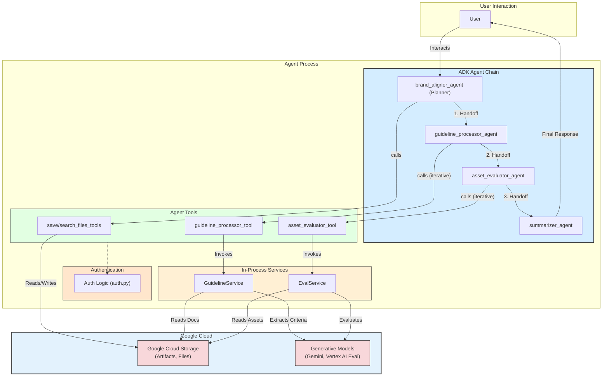

# Brand Aligner Agent Architecture

This document provides a visual representation of the Brand Aligner agent's consolidated, in-process architecture.

The agent's logic is self-contained. The backend services (`GuidelineService`, `EvalService`) run as part of the agent's own process, and the agent's tools invoke these services directly without making network calls.

